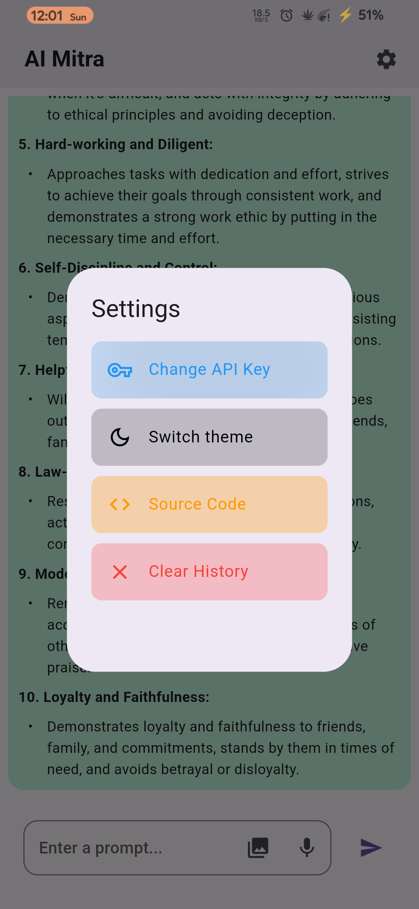
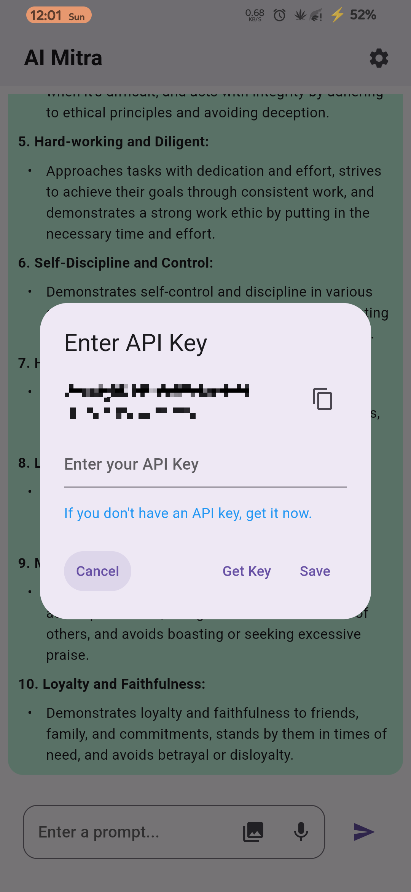

# AI मित्र

Chat with Google Gemini using Text, Image, Voice.

## What is supported

- ✅ Chat with Text.
- ✅ Chat with Gallery Image.
- ✅ Chat with Camera Image.
- ✅ Chat with voice.
- ❌ Chat with pdf file.

## Getting Started

> [!Requirenments]
> - Flutter 
> - Gemini's API Key


To get started with the **this** app, follow these simple steps:

> #### Clone the Git Repository
>
> ```bash
> git clone https://github.com/sapatevaibhav/ai_mitra
> ```

> ### Run the Flutter Project
>
>Ensure you have Flutter installed. If not, you can follow the instructions on [Flutter.dev](https://flutter.dev/) to get it installed on your machine.
>
>Navigate to the project directory using the terminal.
>
>Run the following command to fetch the >dependencies:
>```bash 
>flutter pub get
>```
>Once the dependencies are fetched, run the app on your preferred device using:
>```bash
>flutter run
>```
>That's it! The app should now be running on your device/emulator.


> [!Note] 
> During development I tested this app on.
> * OnePlus gaucamoleb.
> * Operating System - Project Elixir v4.1 A14.


> [!dependencies]
>- Flutter: 3.16.0
>- Dart: 3.2.0
>- sdk: '>=3.2.0 <4.0.0'
>- cupertino_icons: ^1.0.2
>- google_generative_ai: ^0.2.0
>- flutter_markdown: ^0.6.19
>- url_launcher: ^6.2.4
>- adaptive_theme: ^3.6.0
>- speech_to_text: ^6.6.0
>- image_picker: ^1.0.7
>- camera: ^0.10.5+9
>- path_provider: ^2.1.2
>- path: ^1.8.3
>- hive: ^2.2.3
>- DevTools: 2.28.2

### ScreenShots
- home {height=200px}
{height=200px}
{height=200px}
{height=200px}
{height=200px}
{height=200px}
{height=200px}
{height=200px}

